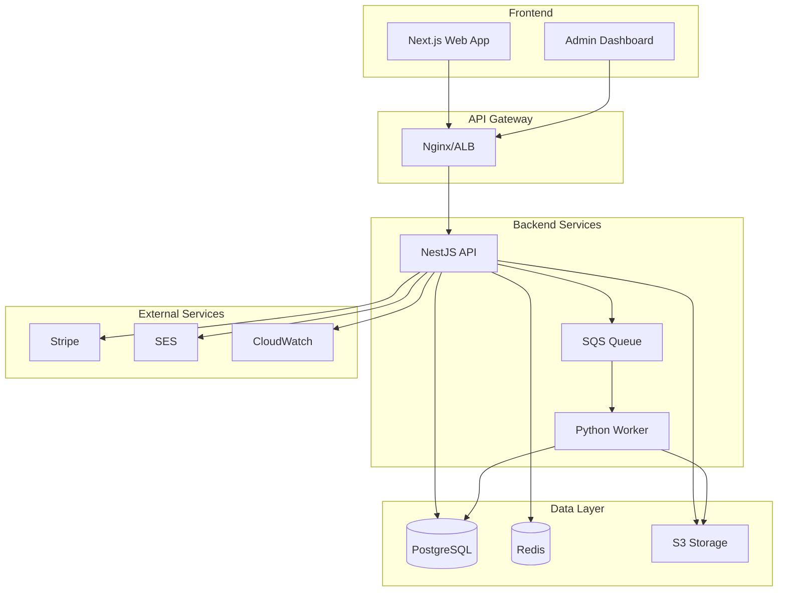
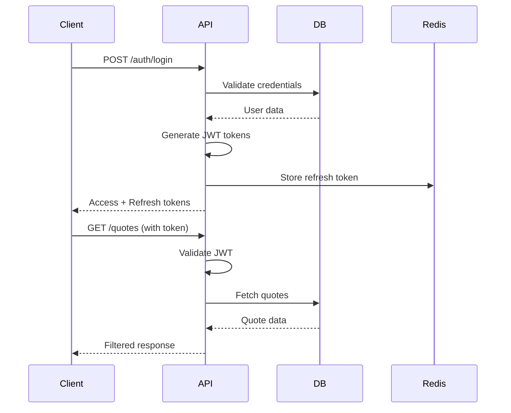
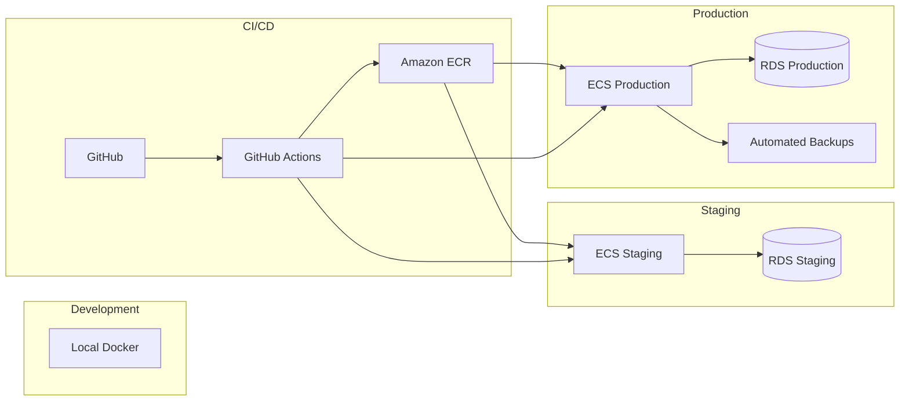

# MADFAM Quoting System Architecture

## System Overview

The MADFAM Quoting System is a multi-tenant SaaS platform for automated digital fabrication quotes. Built with a microservices architecture, it supports 3D printing, CNC machining, and laser cutting with real-time pricing calculations.



## Architecture Principles

### 1. Multi-Tenant Isolation
- Row-level security in PostgreSQL
- Tenant context propagated through all layers
- Separate S3 prefixes per tenant
- Isolated encryption keys via AWS KMS

### 2. Microservices Design
- API: Business logic and orchestration
- Worker: CPU-intensive geometry analysis
- Frontend: Customer-facing UI
- Admin: Internal management tools

### 3. Event-Driven Processing
- Asynchronous file processing via SQS
- Real-time updates via WebSockets (future)
- Event sourcing for audit trail

### 4. Scalability First
- Horizontal scaling via ECS Fargate
- Database read replicas
- CDN for static assets
- Queue-based load leveling

## Component Architecture

### Frontend (Next.js)

```
apps/web/
├── app/                    # App Router pages
│   ├── [locale]/          # i18n routing
│   ├── api/               # API routes
│   └── auth/              # Auth pages
├── components/            # React components
│   ├── quotes/           # Quote components
│   ├── ui/               # shadcn/ui components
│   └── layout/           # Layout components
├── lib/                   # Utilities
│   ├── api/              # API client
│   ├── auth/             # Auth helpers
│   └── i18n/             # Translations
└── hooks/                 # Custom React hooks
```

**Key Features:**
- Server-side rendering for SEO
- Incremental static regeneration
- Optimistic UI updates
- Progressive enhancement

### Backend API (NestJS)

```
apps/api/src/
├── modules/
│   ├── auth/             # Authentication
│   ├── quotes/           # Quote management
│   ├── orders/           # Order processing
│   ├── payment/          # Payment integration
│   ├── files/            # File management
│   ├── admin/            # Admin functions
│   └── jobs/             # Background jobs
├── common/
│   ├── guards/           # Auth guards
│   ├── interceptors/     # Request interceptors
│   ├── pipes/            # Validation pipes
│   └── filters/          # Exception filters
└── prisma/                # Database schema
```

**Design Patterns:**
- Repository pattern for data access
- Command/Query separation
- Dependency injection
- Domain-driven design

### Worker Service (Python)

```
apps/worker/
├── geometry_analyzer.py   # Main service
├── processors/
│   ├── stl_processor.py  # STL file processing
│   ├── step_processor.py # STEP file processing
│   └── dxf_processor.py  # DXF file processing
├── dfm/
│   ├── rules.py          # DFM rule engine
│   └── validators/       # Process validators
└── utils/
    ├── mesh_utils.py     # Mesh operations
    └── file_utils.py     # File handling
```

**Processing Pipeline:**
1. Receive message from SQS
2. Download file from S3
3. Parse geometry
4. Run DFM analysis
5. Calculate metrics
6. Store results in database

### Pricing Engine

```
packages/pricing-engine/
├── calculators/
│   ├── base.calculator.ts
│   ├── fff.calculator.ts
│   ├── sla.calculator.ts
│   ├── cnc.calculator.ts
│   └── laser.calculator.ts
├── engine.ts              # Main engine
└── types/                 # TypeScript types
```

**Calculation Flow:**
1. Material usage calculation
2. Processing time estimation
3. Cost component aggregation
4. Margin enforcement
5. Volume discount application
6. Sustainability scoring

## Data Architecture

### Database Schema

```sql
-- Multi-tenant base
CREATE TABLE tenants (
    id UUID PRIMARY KEY,
    subdomain VARCHAR(63) UNIQUE,
    settings JSONB
);

-- Row-level security
ALTER TABLE quotes ENABLE ROW LEVEL SECURITY;
CREATE POLICY tenant_isolation ON quotes
    FOR ALL USING (tenant_id = current_setting('app.tenant_id')::uuid);

-- Main entities
quotes
├── quote_items
│   ├── quote_item_selections
│   └── quote_item_files
├── orders
│   └── order_items
└── payments

-- Configuration
materials
machines
pricing_rules
discount_rules
```

### Data Flow

1. **Quote Creation:**
   ```
   Client → Upload File → S3
          ↓
   Create Quote → Queue DFM Job
          ↓
   Worker Process → Store Results
          ↓
   Calculate Price → Return Quote
   ```

2. **Order Processing:**
   ```
   Accept Quote → Create Order
         ↓
   Payment Session → Stripe Checkout
         ↓
   Webhook → Update Order Status
         ↓
   Generate Work Order → Production
   ```

### Caching Strategy

**Redis Usage:**
- Session storage (15 min TTL)
- API response cache (5 min TTL)
- Rate limiting counters
- Temporary file metadata
- Feature flags

**Cache Invalidation:**
- Quote changes: Invalidate quote cache
- Material updates: Invalidate pricing cache
- Configuration changes: Clear tenant cache

## Security Architecture

### Authentication Flow



### Security Layers

1. **Network Security:**
   - AWS VPC with private subnets
   - Security groups per service
   - WAF rules for common attacks
   - DDoS protection via CloudFront

2. **Application Security:**
   - Input validation with Zod
   - SQL injection prevention (Prisma)
   - XSS protection headers
   - CORS whitelisting

3. **Data Security:**
   - Encryption at rest (RDS, S3)
   - Encryption in transit (TLS 1.2+)
   - Key rotation via KMS
   - Secrets in AWS Secrets Manager

4. **Access Control:**
   - Role-based permissions
   - Tenant isolation
   - API key management
   - Audit logging

## Infrastructure Architecture

### AWS Services

```
Production Environment:
├── Compute
│   ├── ECS Fargate (API, Worker)
│   ├── Lambda (Utilities)
│   └── EC2 (Bastion host)
├── Storage
│   ├── RDS PostgreSQL (Multi-AZ)
│   ├── ElastiCache Redis
│   ├── S3 (Files, Backups)
│   └── EFS (Shared storage)
├── Networking
│   ├── VPC (10.0.0.0/16)
│   ├── ALB (Load balancer)
│   ├── CloudFront (CDN)
│   └── Route 53 (DNS)
├── Integration
│   ├── SQS (Job queue)
│   ├── SES (Email)
│   ├── SNS (Notifications)
│   └── EventBridge (Events)
└── Operations
    ├── CloudWatch (Monitoring)
    ├── X-Ray (Tracing)
    ├── Systems Manager
    └── Backup
```

### Deployment Architecture



### Scaling Strategy

1. **Horizontal Scaling:**
   - ECS auto-scaling based on CPU/memory
   - Read replicas for database
   - Queue workers scale with depth

2. **Vertical Scaling:**
   - RDS instance upgrades
   - Redis cluster mode
   - Larger ECS task definitions

3. **Performance Optimization:**
   - Database query optimization
   - N+1 query prevention
   - Connection pooling
   - Response compression

## Monitoring & Observability

### Metrics

**Application Metrics:**
- Request rate and latency
- Error rates by endpoint
- Queue depth and processing time
- Database query performance

**Business Metrics:**
- Quotes created per hour
- Conversion rate (quote to order)
- Average quote value
- Processing time by file type

**Infrastructure Metrics:**
- CPU and memory utilization
- Network throughput
- Disk I/O
- Container health

### Logging

**Log Structure:**
```json
{
  "timestamp": "2024-01-20T10:30:00Z",
  "level": "info",
  "service": "api",
  "correlationId": "req_123456",
  "tenantId": "tenant_789",
  "userId": "user_456",
  "message": "Quote created",
  "metadata": {
    "quoteId": "quote_123",
    "itemCount": 3,
    "totalValue": 1500.00
  }
}
```

**Log Aggregation:**
- CloudWatch Logs for storage
- CloudWatch Insights for analysis
- Alerts on error patterns
- 30-day retention (90 days for audit)

### Distributed Tracing

```
Request Flow:
Client → API → Database
            ↓
         Queue → Worker → S3
            ↓
         Cache
```

**Trace Points:**
- HTTP request entry
- Database queries
- External API calls
- Queue operations
- Cache hits/misses

## Disaster Recovery

### Backup Strategy

1. **Database:**
   - Automated daily backups (7-day retention)
   - Point-in-time recovery (35 days)
   - Cross-region backup replication

2. **Files:**
   - S3 versioning enabled
   - Lifecycle policies for archival
   - Cross-region replication

3. **Configuration:**
   - Infrastructure as Code (Terraform)
   - Secrets backed up encrypted
   - Documentation in Git

### Recovery Procedures

**RTO (Recovery Time Objective): 4 hours**
**RPO (Recovery Point Objective): 1 hour**

1. **Database Failure:**
   - Automatic failover to standby (2 min)
   - Manual restore from backup (2 hours)

2. **Region Failure:**
   - DNS failover to DR region (5 min)
   - Restore from cross-region backups (4 hours)

3. **Data Corruption:**
   - Point-in-time recovery
   - Restore from S3 versions
   - Replay from event log

## Development Workflow

### Local Development

```bash
# Start all services
docker-compose up -d

# Database migrations
npm run db:migrate:dev

# Run tests
npm test

# Start development
npm run dev
```

### Testing Strategy

1. **Unit Tests:**
   - Business logic isolation
   - Mock external dependencies
   - 80% coverage target

2. **Integration Tests:**
   - API endpoint testing
   - Database operations
   - Queue processing

3. **E2E Tests:**
   - Critical user journeys
   - Cross-browser testing
   - Performance benchmarks

### Deployment Process

1. **Feature Development:**
   ```
   feature/* → develop → staging → main
   ```

2. **Release Process:**
   - Automated tests on PR
   - Manual QA on staging
   - Blue-green deployment
   - Smoke tests post-deploy

3. **Rollback:**
   - Previous ECS task definition
   - Database migration rollback
   - S3 version restore

## Future Enhancements

### Planned Features

1. **Real-time Collaboration:**
   - WebSocket quote updates
   - Live pricing adjustments
   - Multi-user quote editing

2. **Advanced Analytics:**
   - ML-based pricing optimization
   - Demand forecasting
   - Customer behavior analysis

3. **Integration Hub:**
   - ERP system connectors
   - CAD software plugins
   - Shipping provider APIs

4. **Mobile Applications:**
   - React Native apps
   - Offline quote viewing
   - Push notifications

### Technical Debt

1. **Current Limitations:**
   - Single region deployment
   - Limited webhook retry logic
   - No GraphQL API
   - Basic search capabilities

2. **Improvement Areas:**
   - Database sharding for scale
   - Event streaming (Kafka/Kinesis)
   - Service mesh (Istio)
   - Advanced caching strategies