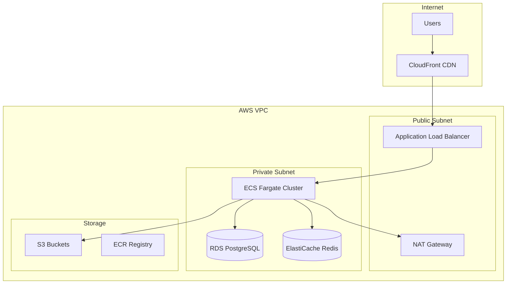

# MADFAM Quoting Deployment Guide

## Overview

This guide covers deploying the MADFAM Quoting system to AWS using Docker containers, ECS Fargate, and supporting AWS services. The deployment is fully automated using Terraform and GitHub Actions.

## Architecture Overview



## Prerequisites

### Local Tools

- AWS CLI v2
- Terraform >= 1.5
- Docker >= 20.10
- kubectl (optional, for EKS deployments)
- jq (for JSON processing)

### AWS Requirements

- AWS Account with appropriate permissions
- Route 53 hosted zone (for domain)
- ACM certificate for HTTPS
- AWS credentials configured locally

### Third-Party Services

- Stripe account with API keys
- SendGrid/SES for email
- Monitoring service (DataDog/New Relic)

## Infrastructure Setup

### 1. AWS Account Preparation

```bash
# Configure AWS CLI
aws configure
# AWS Access Key ID: <your-key>
# AWS Secret Access Key: <your-secret>
# Default region: us-east-1
# Default output format: json

# Verify access
aws sts get-caller-identity
```

### 2. Create S3 Backend for Terraform

```bash
# Create S3 bucket for Terraform state
aws s3 mb s3://madfam-terraform-state-<account-id>

# Enable versioning
aws s3api put-bucket-versioning \
  --bucket madfam-terraform-state-<account-id> \
  --versioning-configuration Status=Enabled

# Create DynamoDB table for state locking
aws dynamodb create-table \
  --table-name madfam-terraform-locks \
  --attribute-definitions AttributeName=LockID,AttributeType=S \
  --key-schema AttributeName=LockID,KeyType=HASH \
  --provisioned-throughput ReadCapacityUnits=1,WriteCapacityUnits=1
```

### 3. Initialize Terraform

```bash
cd infrastructure/terraform/environments/prod

# Initialize Terraform
terraform init -backend-config="bucket=madfam-terraform-state-<account-id>"

# Create workspace
terraform workspace new prod
```

### 4. Configure Terraform Variables

Create `terraform.tfvars`:

```hcl
# General
project_name = "madfam-quoting"
environment = "prod"
region = "us-east-1"
availability_zones = ["us-east-1a", "us-east-1b"]

# Domain
domain_name = "madfam.io"
subdomain = "app"

# Database
db_instance_class = "db.t3.medium"
db_allocated_storage = 100
db_backup_retention_period = 30

# Redis
redis_node_type = "cache.t3.micro"
redis_num_cache_nodes = 2

# ECS
api_cpu = 512
api_memory = 1024
api_desired_count = 2
api_max_count = 10

worker_cpu = 1024
worker_memory = 2048
worker_desired_count = 1
worker_max_count = 5

# Auto Scaling
api_scale_target_cpu = 70
api_scale_target_memory = 80
worker_scale_target_queue_depth = 10
```

### 5. Deploy Infrastructure

```bash
# Plan deployment
terraform plan -out=tfplan

# Review changes
terraform show tfplan

# Apply changes
terraform apply tfplan

# Save outputs
terraform output -json > outputs.json
```

## Application Deployment

### 1. Build Docker Images

```bash
# Set variables
export AWS_ACCOUNT_ID=$(aws sts get-caller-identity --query Account --output text)
export AWS_REGION=us-east-1
export ECR_REGISTRY=$AWS_ACCOUNT_ID.dkr.ecr.$AWS_REGION.amazonaws.com

# Login to ECR
aws ecr get-login-password --region $AWS_REGION | \
  docker login --username AWS --password-stdin $ECR_REGISTRY

# Build images
docker build -t madfam-api -f apps/api/Dockerfile .
docker build -t madfam-web -f apps/web/Dockerfile .
docker build -t madfam-worker -f apps/worker/Dockerfile .

# Tag images
docker tag madfam-api:latest $ECR_REGISTRY/madfam-api:latest
docker tag madfam-web:latest $ECR_REGISTRY/madfam-web:latest
docker tag madfam-worker:latest $ECR_REGISTRY/madfam-worker:latest

# Push images
docker push $ECR_REGISTRY/madfam-api:latest
docker push $ECR_REGISTRY/madfam-web:latest
docker push $ECR_REGISTRY/madfam-worker:latest
```

### 2. Database Setup

```bash
# Get RDS endpoint
export DB_HOST=$(terraform output -raw rds_endpoint)

# Run migrations
DATABASE_URL="postgresql://madfam:$DB_PASSWORD@$DB_HOST/madfam_quoting" \
  npm run db:migrate:deploy

# Seed production data (optional)
DATABASE_URL="postgresql://madfam:$DB_PASSWORD@$DB_HOST/madfam_quoting" \
  npm run db:seed:prod
```

### 3. Deploy ECS Services

```bash
# Update task definitions
aws ecs register-task-definition \
  --cli-input-json file://infrastructure/ecs/task-definitions/api.json

aws ecs register-task-definition \
  --cli-input-json file://infrastructure/ecs/task-definitions/worker.json

# Update services
aws ecs update-service \
  --cluster madfam-prod \
  --service madfam-api \
  --force-new-deployment

aws ecs update-service \
  --cluster madfam-prod \
  --service madfam-worker \
  --force-new-deployment
```

### 4. Deploy Frontend to CloudFront

```bash
# Build frontend
cd apps/web
npm run build

# Sync to S3
aws s3 sync out/ s3://madfam-web-prod/ \
  --delete \
  --cache-control "public, max-age=31536000, immutable" \
  --exclude "*.html" \
  --exclude "_next/static/chunks/pages/*"

# Upload HTML files with different cache
aws s3 sync out/ s3://madfam-web-prod/ \
  --exclude "*" \
  --include "*.html" \
  --include "_next/static/chunks/pages/*" \
  --cache-control "public, max-age=0, must-revalidate"

# Invalidate CloudFront
aws cloudfront create-invalidation \
  --distribution-id $CLOUDFRONT_ID \
  --paths "/*"
```

## CI/CD Pipeline

### GitHub Actions Workflow

```yaml
# .github/workflows/deploy.yml
name: Deploy to Production

on:
  push:
    branches: [main]

env:
  AWS_REGION: us-east-1
  ECR_REGISTRY: ${{ secrets.AWS_ACCOUNT_ID }}.dkr.ecr.us-east-1.amazonaws.com

jobs:
  test:
    runs-on: ubuntu-latest
    steps:
      - uses: actions/checkout@v3

      - name: Setup Node.js
        uses: actions/setup-node@v3
        with:
          node-version: '18'
          cache: 'npm'

      - name: Install dependencies
        run: npm ci

      - name: Run tests
        run: npm test

      - name: Run linting
        run: npm run lint

  build-and-push:
    needs: test
    runs-on: ubuntu-latest
    strategy:
      matrix:
        service: [api, web, worker]

    steps:
      - uses: actions/checkout@v3

      - name: Configure AWS credentials
        uses: aws-actions/configure-aws-credentials@v2
        with:
          aws-access-key-id: ${{ secrets.AWS_ACCESS_KEY_ID }}
          aws-secret-access-key: ${{ secrets.AWS_SECRET_ACCESS_KEY }}
          aws-region: ${{ env.AWS_REGION }}

      - name: Login to Amazon ECR
        id: login-ecr
        uses: aws-actions/amazon-ecr-login@v1

      - name: Build and push Docker image
        env:
          IMAGE_TAG: ${{ github.sha }}
        run: |
          docker build -t $ECR_REGISTRY/madfam-${{ matrix.service }}:$IMAGE_TAG \
            -f apps/${{ matrix.service }}/Dockerfile .
          docker push $ECR_REGISTRY/madfam-${{ matrix.service }}:$IMAGE_TAG
          docker tag $ECR_REGISTRY/madfam-${{ matrix.service }}:$IMAGE_TAG \
            $ECR_REGISTRY/madfam-${{ matrix.service }}:latest
          docker push $ECR_REGISTRY/madfam-${{ matrix.service }}:latest

  deploy:
    needs: build-and-push
    runs-on: ubuntu-latest

    steps:
      - uses: actions/checkout@v3

      - name: Configure AWS credentials
        uses: aws-actions/configure-aws-credentials@v2
        with:
          aws-access-key-id: ${{ secrets.AWS_ACCESS_KEY_ID }}
          aws-secret-access-key: ${{ secrets.AWS_SECRET_ACCESS_KEY }}
          aws-region: ${{ env.AWS_REGION }}

      - name: Deploy to ECS
        run: |
          # Update API service
          aws ecs update-service \
            --cluster madfam-prod \
            --service madfam-api \
            --force-new-deployment

          # Update Worker service
          aws ecs update-service \
            --cluster madfam-prod \
            --service madfam-worker \
            --force-new-deployment

      - name: Deploy Frontend
        run: |
          cd apps/web
          npm ci
          npm run build

          # Sync to S3
          aws s3 sync out/ s3://madfam-web-prod/ --delete

          # Invalidate CloudFront
          aws cloudfront create-invalidation \
            --distribution-id ${{ secrets.CLOUDFRONT_ID }} \
            --paths "/*"
```

## Environment Configuration

### Production Secrets

Store in AWS Secrets Manager:

```bash
# Create secrets
aws secretsmanager create-secret \
  --name madfam/prod/api \
  --secret-string '{
    "DATABASE_URL": "postgresql://...",
    "JWT_SECRET": "...",
    "STRIPE_KEY": "sk_live_...",
    "STRIPE_WEBHOOK_SECRET": "whsec_...",
    "SENDGRID_API_KEY": "..."
  }'

# Reference in ECS task definition
{
  "secrets": [
    {
      "name": "DATABASE_URL",
      "valueFrom": "arn:aws:secretsmanager:region:account:secret:madfam/prod/api:DATABASE_URL::"
    }
  ]
}
```

### Environment Variables

```bash
# API Environment
NODE_ENV=production
PORT=4000
API_PREFIX=api/v1
CORS_ORIGINS=https://app.madfam.io

# Database
DATABASE_URL=<from-secrets>
DB_POOL_MIN=2
DB_POOL_MAX=10

# Redis
REDIS_URL=redis://madfam-redis.cache.amazonaws.com:6379
REDIS_TTL=300

# AWS
AWS_REGION=us-east-1
S3_BUCKET=madfam-files-prod
SQS_QUEUE_URL=https://sqs.us-east-1.amazonaws.com/.../madfam-jobs

# Monitoring
SENTRY_DSN=https://...@sentry.io/...
NEW_RELIC_LICENSE_KEY=...
LOG_LEVEL=info
```

## Monitoring Setup

### CloudWatch Dashboards

```bash
# Create dashboard
aws cloudwatch put-dashboard \
  --dashboard-name madfam-prod \
  --dashboard-body file://infrastructure/monitoring/dashboard.json
```

### Alarms

```bash
# API high error rate
aws cloudwatch put-metric-alarm \
  --alarm-name madfam-api-error-rate \
  --alarm-description "API error rate > 1%" \
  --metric-name 4XXError \
  --namespace AWS/ApplicationELB \
  --statistic Sum \
  --period 300 \
  --threshold 50 \
  --comparison-operator GreaterThanThreshold \
  --evaluation-periods 2

# Database CPU
aws cloudwatch put-metric-alarm \
  --alarm-name madfam-rds-cpu \
  --alarm-description "RDS CPU > 80%" \
  --metric-name CPUUtilization \
  --namespace AWS/RDS \
  --statistic Average \
  --period 300 \
  --threshold 80 \
  --comparison-operator GreaterThanThreshold \
  --evaluation-periods 2

# Queue depth
aws cloudwatch put-metric-alarm \
  --alarm-name madfam-queue-depth \
  --alarm-description "Queue depth > 1000" \
  --metric-name ApproximateNumberOfMessagesVisible \
  --namespace AWS/SQS \
  --statistic Average \
  --period 300 \
  --threshold 1000 \
  --comparison-operator GreaterThanThreshold \
  --evaluation-periods 1
```

### Log Aggregation

```bash
# Create log groups
aws logs create-log-group --log-group-name /ecs/madfam-api
aws logs create-log-group --log-group-name /ecs/madfam-worker

# Set retention
aws logs put-retention-policy \
  --log-group-name /ecs/madfam-api \
  --retention-in-days 30
```

## Deployment Procedures

### Blue-Green Deployment

1. **Create new task definition version**

```bash
aws ecs register-task-definition \
  --cli-input-json file://task-definition-new.json
```

2. **Update service with new task definition**

```bash
aws ecs update-service \
  --cluster madfam-prod \
  --service madfam-api \
  --task-definition madfam-api:new-version \
  --deployment-configuration "maximumPercent=200,minimumHealthyPercent=100"
```

3. **Monitor deployment**

```bash
aws ecs describe-services \
  --cluster madfam-prod \
  --services madfam-api \
  --query "services[0].deployments"
```

4. **Rollback if needed**

```bash
aws ecs update-service \
  --cluster madfam-prod \
  --service madfam-api \
  --task-definition madfam-api:previous-version
```

### Database Migrations

```bash
# 1. Create backup
aws rds create-db-snapshot \
  --db-instance-identifier madfam-prod \
  --db-snapshot-identifier madfam-prod-$(date +%Y%m%d-%H%M%S)

# 2. Run migration in transaction
DATABASE_URL=$PROD_DATABASE_URL npm run db:migrate:deploy

# 3. Verify migration
psql $PROD_DATABASE_URL -c "SELECT version FROM _prisma_migrations ORDER BY finished_at DESC LIMIT 1"
```

### Hotfix Deployment

```bash
# 1. Create hotfix branch
git checkout -b hotfix/critical-fix main

# 2. Make fix and test locally

# 3. Deploy directly to production
git push origin hotfix/critical-fix:main

# 4. Create PR to develop for consistency
git checkout develop
git merge hotfix/critical-fix
git push origin develop
```

## Scaling

### Auto Scaling Configuration

```json
{
  "targetTrackingScalingPolicies": [
    {
      "targetValue": 70.0,
      "predefinedMetricSpecification": {
        "predefinedMetricType": "ECSServiceAverageCPUUtilization"
      },
      "scaleOutCooldown": 60,
      "scaleInCooldown": 180
    },
    {
      "targetValue": 80.0,
      "predefinedMetricSpecification": {
        "predefinedMetricType": "ECSServiceAverageMemoryUtilization"
      },
      "scaleOutCooldown": 60,
      "scaleInCooldown": 180
    }
  ]
}
```

### Manual Scaling

```bash
# Scale API service
aws ecs update-service \
  --cluster madfam-prod \
  --service madfam-api \
  --desired-count 5

# Scale worker service
aws ecs update-service \
  --cluster madfam-prod \
  --service madfam-worker \
  --desired-count 3

# Scale RDS (requires downtime)
aws rds modify-db-instance \
  --db-instance-identifier madfam-prod \
  --db-instance-class db.t3.large \
  --apply-immediately
```

## Backup and Recovery

### Automated Backups

```bash
# RDS automated backups (configured in Terraform)
# - Daily snapshots at 3 AM UTC
# - 30-day retention
# - Point-in-time recovery enabled

# S3 lifecycle for file archival
aws s3api put-bucket-lifecycle-configuration \
  --bucket madfam-files-prod \
  --lifecycle-configuration file://s3-lifecycle.json
```

### Manual Backup

```bash
# Database backup
aws rds create-db-snapshot \
  --db-instance-identifier madfam-prod \
  --db-snapshot-identifier madfam-prod-manual-$(date +%Y%m%d)

# Application state backup
aws s3 sync s3://madfam-files-prod s3://madfam-backup-$(date +%Y%m%d)/ \
  --storage-class GLACIER
```

### Disaster Recovery

```bash
# 1. Restore database from snapshot
aws rds restore-db-instance-from-db-snapshot \
  --db-instance-identifier madfam-prod-restored \
  --db-snapshot-identifier madfam-prod-snapshot-id

# 2. Update connection strings
aws ecs update-service \
  --cluster madfam-prod \
  --service madfam-api \
  --task-definition madfam-api:dr-config

# 3. Restore S3 files
aws s3 sync s3://madfam-backup-20240120/ s3://madfam-files-prod/ \
  --storage-class STANDARD
```

## Security Hardening

### Network Security

```bash
# Update security groups
aws ec2 authorize-security-group-ingress \
  --group-id sg-xxx \
  --protocol tcp \
  --port 443 \
  --source-group sg-yyy

# Enable VPC Flow Logs
aws ec2 create-flow-logs \
  --resource-type VPC \
  --resource-ids vpc-xxx \
  --traffic-type ALL \
  --log-destination-type cloud-watch-logs \
  --log-group-name /aws/vpc/flowlogs
```

### Secrets Rotation

```bash
# Enable automatic rotation
aws secretsmanager rotate-secret \
  --secret-id madfam/prod/api \
  --rotation-lambda-arn arn:aws:lambda:region:account:function:SecretsManagerRotation
```

### SSL/TLS Configuration

```bash
# Update ALB listener
aws elbv2 modify-listener \
  --listener-arn arn:aws:elasticloadbalancing:... \
  --protocol HTTPS \
  --certificates CertificateArn=arn:aws:acm:... \
  --ssl-policy ELBSecurityPolicy-TLS-1-2-2017-01
```

## Troubleshooting

### Common Issues

#### ECS Task Failures

```bash
# Check task stopped reason
aws ecs describe-tasks \
  --cluster madfam-prod \
  --tasks arn:aws:ecs:... \
  --query "tasks[0].stoppedReason"

# View container logs
aws logs get-log-events \
  --log-group-name /ecs/madfam-api \
  --log-stream-name ecs/madfam-api/task-id
```

#### Database Connection Issues

```bash
# Test connectivity
aws rds describe-db-instances \
  --db-instance-identifier madfam-prod \
  --query "DBInstances[0].Endpoint"

# Check security groups
aws ec2 describe-security-groups \
  --group-ids sg-xxx \
  --query "SecurityGroups[0].IpPermissions"
```

#### High Memory Usage

```bash
# Check ECS metrics
aws cloudwatch get-metric-statistics \
  --namespace ECS/ContainerInsights \
  --metric-name MemoryUtilized \
  --dimensions Name=ServiceName,Value=madfam-api \
  --start-time 2024-01-20T00:00:00Z \
  --end-time 2024-01-20T23:59:59Z \
  --period 300 \
  --statistics Average
```

### Recovery Procedures

#### Service Restart

```bash
# Restart all tasks
aws ecs update-service \
  --cluster madfam-prod \
  --service madfam-api \
  --force-new-deployment
```

#### Emergency Scale Down

```bash
# Reduce costs during incident
aws ecs update-service \
  --cluster madfam-prod \
  --service madfam-api \
  --desired-count 1

aws rds modify-db-instance \
  --db-instance-identifier madfam-prod \
  --db-instance-class db.t3.micro \
  --apply-immediately
```

## Maintenance

### Regular Tasks

- **Daily**: Check CloudWatch dashboards
- **Weekly**: Review error logs and metrics
- **Monthly**: Update dependencies and patches
- **Quarterly**: Disaster recovery drill
- **Annually**: Security audit and pen testing

### Update Procedures

```bash
# 1. Update dependencies
npm update
npm audit fix

# 2. Test in staging
git checkout develop
git pull origin develop
# Deploy to staging and test

# 3. Create release
git checkout main
git merge develop
git tag -a v1.2.3 -m "Release version 1.2.3"
git push origin main --tags

# 4. Monitor deployment
# CI/CD will automatically deploy
```
