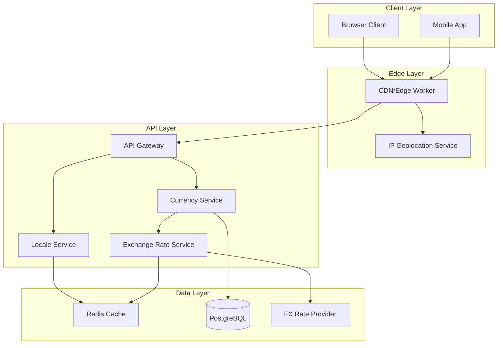

# Multicurrency & Geo-Detection System Design

## Executive Summary

This document outlines the architecture and implementation strategy for adding comprehensive multicurrency support and automatic geo-detection to Cotiza Studio. The system will automatically detect user location to provide appropriate language and currency defaults while allowing manual override.

## 1. System Architecture

### 1.1 Core Components



### 1.2 Geo-Detection Strategy

**Multi-Layer Detection:**
1. **CloudFlare/Vercel Edge Headers** (Primary)
   - `CF-IPCountry` / `X-Vercel-IP-Country`
   - `CF-IPCity` / `X-Vercel-IP-City`
   - `CF-Timezone` / `X-Vercel-IP-Timezone`

2. **IP Geolocation API** (Fallback)
   - MaxMind GeoIP2
   - IPinfo.io
   - IP2Location

3. **Browser API** (Client-Side Enhancement)
   - `navigator.language`
   - `Intl.DateTimeFormat().resolvedOptions().timeZone`
   - `navigator.geolocation` (with permission)

### 1.3 Currency & Locale Mapping

```typescript
interface GeoMapping {
  country: string;
  defaultCurrency: Currency;
  defaultLocale: Locale;
  supportedCurrencies: Currency[];
  timezone: string;
}

const geoMappings: Record<string, GeoMapping> = {
  'MX': {
    country: 'Mexico',
    defaultCurrency: 'MXN',
    defaultLocale: 'es',
    supportedCurrencies: ['MXN', 'USD'],
    timezone: 'America/Mexico_City'
  },
  'US': {
    country: 'United States',
    defaultCurrency: 'USD',
    defaultLocale: 'en',
    supportedCurrencies: ['USD'],
    timezone: 'America/New_York'
  },
  'BR': {
    country: 'Brazil',
    defaultCurrency: 'BRL',
    defaultLocale: 'pt-BR',
    supportedCurrencies: ['BRL', 'USD'],
    timezone: 'America/Sao_Paulo'
  },
  'ES': {
    country: 'Spain',
    defaultCurrency: 'EUR',
    defaultLocale: 'es',
    supportedCurrencies: ['EUR'],
    timezone: 'Europe/Madrid'
  },
  // ... more countries
};
```

## 2. Data Models

### 2.1 Enhanced Currency Support

```prisma
// Update existing Currency enum
enum Currency {
  MXN  // Mexican Peso
  USD  // US Dollar
  EUR  // Euro
  BRL  // Brazilian Real
  CAD  // Canadian Dollar
  GBP  // British Pound
  CNY  // Chinese Yuan
  JPY  // Japanese Yen
}

// New ExchangeRate model
model ExchangeRate {
  id           String   @id @default(cuid())
  baseCurrency Currency
  targetCurrency Currency
  rate         Decimal  @db.Decimal(12, 6)
  source       String   // 'openexchangerates', 'xe', 'manual'
  validFrom    DateTime
  validUntil   DateTime
  createdAt    DateTime @default(now())
  
  @@unique([baseCurrency, targetCurrency, validFrom])
  @@index([validFrom, validUntil])
}

// New UserPreferences model
model UserPreferences {
  id              String   @id @default(cuid())
  userId          String   @unique
  preferredLocale String   @default("es")
  preferredCurrency Currency @default(MXN)
  timezone        String?
  autoDetect      Boolean  @default(true)
  createdAt       DateTime @default(now())
  updatedAt       DateTime @updatedAt
  
  user User @relation(fields: [userId], references: [id])
}

// New GeoSession model for guests
model GeoSession {
  id              String   @id @default(cuid())
  sessionId       String   @unique
  ipAddress       String
  country         String?
  city            String?
  region          String?
  timezone        String?
  detectedLocale  String?
  detectedCurrency Currency?
  selectedLocale  String?
  selectedCurrency Currency?
  userAgent       String?
  createdAt       DateTime @default(now())
  updatedAt       DateTime @updatedAt
  
  @@index([sessionId])
  @@index([ipAddress])
}

// Update Quote model
model Quote {
  // ... existing fields
  currency       Currency @default(MXN)
  exchangeRate   Decimal? @db.Decimal(12, 6) // Rate used at quote creation
  baseCurrency   Currency? // Original pricing currency
  // ... rest of fields
}
```

### 2.2 Pricing Models

```prisma
// Multi-currency pricing support
model MaterialPricing {
  id           String   @id @default(cuid())
  materialId   String
  currency     Currency
  pricePerUnit Decimal  @db.Decimal(10, 2)
  validFrom    DateTime
  validUntil   DateTime?
  
  material Material @relation(fields: [materialId], references: [id])
  
  @@unique([materialId, currency, validFrom])
  @@index([materialId, currency])
}

model ProcessPricing {
  id         String   @id @default(cuid())
  processId  String
  currency   Currency
  setupCost  Decimal  @db.Decimal(10, 2)
  hourlyRate Decimal  @db.Decimal(10, 2)
  validFrom  DateTime
  validUntil DateTime?
  
  process ManufacturingProcess @relation(fields: [processId], references: [id])
  
  @@unique([processId, currency, validFrom])
}
```

## 3. API Design

### 3.1 Geo-Detection Endpoint

```typescript
// GET /api/v1/geo/detect
interface GeoDetectionResponse {
  detected: {
    country: string;
    countryCode: string;
    city?: string;
    region?: string;
    timezone: string;
    locale: string;
    currency: Currency;
    confidence: number; // 0-100
  };
  recommended: {
    locale: string;
    currency: Currency;
    alternativeLocales: string[];
    alternativeCurrencies: Currency[];
  };
  userPreferences?: {
    locale: string;
    currency: Currency;
    autoDetect: boolean;
  };
}

// POST /api/v1/geo/preferences
interface UpdatePreferencesRequest {
  locale?: string;
  currency?: Currency;
  timezone?: string;
  autoDetect?: boolean;
}
```

### 3.2 Currency Exchange Endpoints

```typescript
// GET /api/v1/currency/rates
interface ExchangeRatesRequest {
  base: Currency;
  targets?: Currency[]; // All if not specified
  date?: string; // ISO date, current if not specified
}

interface ExchangeRatesResponse {
  base: Currency;
  date: string;
  rates: Record<Currency, number>;
  source: string;
  updatedAt: string;
}

// POST /api/v1/currency/convert
interface CurrencyConversionRequest {
  amount: number;
  from: Currency;
  to: Currency;
  date?: string; // Historical rate if specified
}

interface CurrencyConversionResponse {
  originalAmount: number;
  originalCurrency: Currency;
  convertedAmount: number;
  convertedCurrency: Currency;
  rate: number;
  inverseRate: number;
  date: string;
  fees?: {
    percentage: number;
    fixed: number;
    total: number;
  };
}
```

### 3.3 Quote Multicurrency Support

```typescript
// GET /api/v1/quotes/{id}?currency=USD
interface QuoteResponse {
  // ... existing fields
  pricing: {
    currency: Currency;
    subtotal: number;
    tax: number;
    shipping: number;
    total: number;
    exchangeRate?: number; // If converted from base currency
    originalCurrency?: Currency;
    originalTotal?: number;
  };
  alternativeCurrencies: Array<{
    currency: Currency;
    total: number;
    rate: number;
  }>;
}

// POST /api/v1/quotes
interface CreateQuoteRequest {
  // ... existing fields
  currency?: Currency; // Defaults to user preference or geo-detected
  showAlternativeCurrencies?: boolean;
}
```

## 4. Implementation Strategy

### 4.1 Phase 1: Infrastructure (Week 1-2)
- [ ] Set up edge detection using Vercel/CloudFlare headers
- [ ] Implement IP geolocation fallback service
- [ ] Create GeoSession tracking for guests
- [ ] Add UserPreferences model and API

### 4.2 Phase 2: Currency Engine (Week 2-3)
- [ ] Integrate exchange rate provider (OpenExchangeRates/XE)
- [ ] Implement rate caching with Redis (1hr TTL)
- [ ] Build currency conversion service with fee calculation
- [ ] Add historical rate support for reporting

### 4.3 Phase 3: Frontend Integration (Week 3-4)
- [ ] Implement geo-detection hook
- [ ] Add currency selector component
- [ ] Update pricing displays with currency symbols
- [ ] Implement real-time currency conversion UI

### 4.4 Phase 4: Quote System Update (Week 4-5)
- [ ] Update quote creation with currency selection
- [ ] Add multi-currency pricing display
- [ ] Implement currency lock at quote creation
- [ ] Add currency conversion audit trail

### 4.5 Phase 5: Testing & Optimization (Week 5-6)
- [ ] Load testing with multiple currencies
- [ ] Edge case testing (VPN, proxies)
- [ ] A/B testing for auto-detection accuracy
- [ ] Performance optimization

## 5. Technical Implementation Details

### 5.1 Geo-Detection Service

```typescript
// services/geo-detection.service.ts
@Injectable()
export class GeoDetectionService {
  constructor(
    private readonly redis: RedisService,
    private readonly httpService: HttpService,
    private readonly prisma: PrismaService,
  ) {}

  async detectFromRequest(req: Request): Promise<GeoDetection> {
    // 1. Check edge headers
    const countryCode = 
      req.headers['cf-ipcountry'] || 
      req.headers['x-vercel-ip-country'] ||
      req.headers['x-country-code'];
    
    if (countryCode && countryCode !== 'XX') {
      return this.mapCountryToGeo(countryCode as string);
    }

    // 2. Check cache
    const ip = this.getClientIp(req);
    const cached = await this.redis.get(`geo:${ip}`);
    if (cached) return JSON.parse(cached);

    // 3. Call IP service
    const geoData = await this.fetchGeoData(ip);
    
    // 4. Cache result
    await this.redis.set(
      `geo:${ip}`, 
      JSON.stringify(geoData),
      'EX',
      86400 // 24 hours
    );

    return geoData;
  }

  private async fetchGeoData(ip: string): Promise<GeoDetection> {
    try {
      // Use MaxMind or IPinfo
      const response = await this.httpService
        .get(`https://ipinfo.io/${ip}/json`, {
          headers: {
            'Authorization': `Bearer ${process.env.IPINFO_TOKEN}`
          }
        })
        .toPromise();

      return this.parseGeoResponse(response.data);
    } catch (error) {
      // Return default
      return this.getDefaultGeo();
    }
  }
}
```

### 5.2 Currency Service

```typescript
// services/currency.service.ts
@Injectable()
export class CurrencyService {
  private rates: Map<string, ExchangeRate> = new Map();
  
  constructor(
    private readonly redis: RedisService,
    private readonly httpService: HttpService,
    private readonly prisma: PrismaService,
  ) {
    this.scheduleRateUpdates();
  }

  async getRate(
    from: Currency, 
    to: Currency, 
    date?: Date
  ): Promise<number> {
    if (from === to) return 1;

    const key = `${from}-${to}`;
    
    // Check cache
    const cached = await this.redis.get(`rate:${key}`);
    if (cached) return parseFloat(cached);

    // Fetch from DB or provider
    const rate = await this.fetchRate(from, to, date);
    
    // Cache for 1 hour
    await this.redis.set(`rate:${key}`, rate.toString(), 'EX', 3600);
    
    return rate;
  }

  async convert(
    amount: number,
    from: Currency,
    to: Currency,
    options?: ConversionOptions
  ): Promise<ConversionResult> {
    const rate = await this.getRate(from, to, options?.date);
    
    let convertedAmount = amount * rate;
    
    // Apply fees if configured
    if (options?.includeFees) {
      const fees = this.calculateFees(amount, from, to);
      convertedAmount -= fees.total;
    }

    // Apply rounding rules per currency
    convertedAmount = this.roundByCurrency(convertedAmount, to);

    return {
      originalAmount: amount,
      originalCurrency: from,
      convertedAmount,
      convertedCurrency: to,
      rate,
      inverseRate: 1 / rate,
      fees: options?.includeFees ? this.calculateFees(amount, from, to) : undefined,
      timestamp: new Date(),
    };
  }

  private roundByCurrency(amount: number, currency: Currency): number {
    const roundingRules: Record<Currency, number> = {
      JPY: 0, // No decimals
      USD: 2,
      EUR: 2,
      MXN: 2,
      BRL: 2,
      GBP: 2,
      CAD: 2,
      CNY: 2,
    };

    const decimals = roundingRules[currency] || 2;
    return Math.round(amount * Math.pow(10, decimals)) / Math.pow(10, decimals);
  }

  @Cron('0 */6 * * *') // Every 6 hours
  private async updateExchangeRates() {
    try {
      const response = await this.httpService
        .get(`https://openexchangerates.org/api/latest.json`, {
          params: {
            app_id: process.env.OPENEXCHANGE_APP_ID,
            base: 'USD',
          }
        })
        .toPromise();

      const rates = response.data.rates;
      
      // Store in database
      for (const [currency, rate] of Object.entries(rates)) {
        if (this.isSupportedCurrency(currency)) {
          await this.prisma.exchangeRate.create({
            data: {
              baseCurrency: 'USD',
              targetCurrency: currency as Currency,
              rate: new Decimal(rate as number),
              source: 'openexchangerates',
              validFrom: new Date(),
              validUntil: new Date(Date.now() + 24 * 60 * 60 * 1000),
            }
          });
        }
      }
      
      // Invalidate cache
      await this.redis.del('rate:*');
    } catch (error) {
      this.logger.error('Failed to update exchange rates', error);
    }
  }
}
```

### 5.3 Frontend Hooks

```typescript
// hooks/useGeoDetection.ts
export function useGeoDetection() {
  const [geoData, setGeoData] = useState<GeoDetection | null>(null);
  const [loading, setLoading] = useState(true);

  useEffect(() => {
    const detectGeo = async () => {
      try {
        // Check localStorage first
        const stored = localStorage.getItem('geo-detection');
        if (stored) {
          const parsed = JSON.parse(stored);
          if (Date.now() - parsed.timestamp < 86400000) { // 24h
            setGeoData(parsed.data);
            setLoading(false);
            return;
          }
        }

        // Call API
        const response = await fetch('/api/v1/geo/detect');
        const data = await response.json();
        
        // Store in localStorage
        localStorage.setItem('geo-detection', JSON.stringify({
          data,
          timestamp: Date.now()
        }));
        
        setGeoData(data);
      } catch (error) {
        console.error('Geo detection failed', error);
        // Use defaults
        setGeoData({
          detected: {
            country: 'Mexico',
            countryCode: 'MX',
            timezone: 'America/Mexico_City',
            locale: 'es',
            currency: 'MXN',
            confidence: 0
          },
          recommended: {
            locale: 'es',
            currency: 'MXN',
            alternativeLocales: ['en', 'pt-BR'],
            alternativeCurrencies: ['USD', 'EUR']
          }
        });
      } finally {
        setLoading(false);
      }
    };

    detectGeo();
  }, []);

  const updatePreferences = async (prefs: Partial<UserPreferences>) => {
    try {
      await fetch('/api/v1/geo/preferences', {
        method: 'POST',
        headers: { 'Content-Type': 'application/json' },
        body: JSON.stringify(prefs)
      });
      
      // Update local state
      setGeoData(prev => ({
        ...prev!,
        userPreferences: {
          ...prev?.userPreferences,
          ...prefs
        }
      }));
    } catch (error) {
      console.error('Failed to update preferences', error);
    }
  };

  return {
    geoData,
    loading,
    updatePreferences,
    currency: geoData?.userPreferences?.currency || geoData?.recommended.currency,
    locale: geoData?.userPreferences?.locale || geoData?.recommended.locale,
  };
}

// hooks/useCurrency.ts
export function useCurrency() {
  const { currency: defaultCurrency } = useGeoDetection();
  const [currency, setCurrency] = useState<Currency>(defaultCurrency || 'MXN');
  const [rates, setRates] = useState<Record<Currency, number>>({});

  useEffect(() => {
    const fetchRates = async () => {
      try {
        const response = await fetch(`/api/v1/currency/rates?base=${currency}`);
        const data = await response.json();
        setRates(data.rates);
      } catch (error) {
        console.error('Failed to fetch rates', error);
      }
    };

    fetchRates();
  }, [currency]);

  const format = (amount: number, curr?: Currency) => {
    const targetCurrency = curr || currency;
    return new Intl.NumberFormat(getLocaleForCurrency(targetCurrency), {
      style: 'currency',
      currency: targetCurrency,
      minimumFractionDigits: getCurrencyDecimals(targetCurrency),
      maximumFractionDigits: getCurrencyDecimals(targetCurrency)
    }).format(amount);
  };

  const convert = (amount: number, from: Currency, to: Currency) => {
    if (from === to) return amount;
    
    // Convert to base currency first, then to target
    const toBase = rates[from] ? amount / rates[from] : amount;
    const converted = rates[to] ? toBase * rates[to] : toBase;
    
    return Math.round(converted * 100) / 100;
  };

  return {
    currency,
    setCurrency,
    rates,
    format,
    convert,
    symbols: CURRENCY_SYMBOLS,
  };
}
```

## 6. Security Considerations

### 6.1 Rate Limiting
- Implement rate limiting on geo-detection endpoints (100 req/min per IP)
- Cache geo-detection results for 24 hours per IP
- Rate limit currency conversion API (1000 req/hour per user)

### 6.2 Data Privacy
- Store only necessary geo data
- Comply with GDPR for EU users
- Allow users to opt-out of geo-detection
- Provide data deletion options

### 6.3 Exchange Rate Security
- Validate rate changes (max ±10% daily change)
- Audit trail for manual rate overrides
- Implement rate source verification
- Add alerts for unusual rate movements

## 7. Performance Optimization

### 7.1 Caching Strategy
```typescript
// Multi-layer caching
const cacheStrategy = {
  edgeCache: {
    geoDetection: '24 hours',
    staticRates: '1 hour'
  },
  redisCache: {
    exchangeRates: '1 hour',
    userPreferences: '30 minutes',
    geoSessions: '24 hours'
  },
  browserCache: {
    geoData: '24 hours',
    rates: '30 minutes',
    preferences: 'session'
  }
};
```

### 7.2 Database Optimization
- Index on currency fields
- Materialized views for common currency pairs
- Partition exchange rate tables by month
- Archive old rates after 1 year

## 8. Monitoring & Analytics

### 8.1 Metrics to Track
- Geo-detection accuracy rate
- Currency conversion volume
- Most used currency pairs
- API response times
- Cache hit rates
- User preference overrides

### 8.2 Alerts
- Exchange rate API failures
- Unusual rate movements (>5% change)
- High error rates on geo-detection
- Cache service degradation
- Database query performance

## 9. Testing Strategy

### 9.1 Unit Tests
- Currency conversion accuracy
- Rounding rules per currency
- Rate caching logic
- Geo-detection parsing

### 9.2 Integration Tests
- End-to-end quote creation with currency
- Multi-currency quote display
- Exchange rate updates
- User preference persistence

### 9.3 E2E Tests
- VPN/proxy detection handling
- Currency switch during checkout
- Historical rate accuracy
- Multi-language currency display

## 10. Migration Plan

### 10.1 Database Migration
```sql
-- Add currency support to existing quotes
ALTER TABLE quotes 
ADD COLUMN exchange_rate DECIMAL(12,6),
ADD COLUMN base_currency VARCHAR(3);

-- Migrate existing MXN quotes
UPDATE quotes 
SET base_currency = 'MXN', 
    exchange_rate = 1.0 
WHERE currency = 'MXN';
```

### 10.2 Feature Flags
```typescript
const featureFlags = {
  enableGeoDetection: process.env.ENABLE_GEO_DETECTION === 'true',
  enableMultiCurrency: process.env.ENABLE_MULTI_CURRENCY === 'true',
  supportedCurrencies: process.env.SUPPORTED_CURRENCIES?.split(',') || ['MXN'],
  defaultCurrency: process.env.DEFAULT_CURRENCY || 'MXN'
};
```

## 11. Documentation

### 11.1 API Documentation
- OpenAPI 3.0 specification updates
- Postman collection with currency examples
- GraphQL schema updates (if applicable)

### 11.2 User Documentation
- Currency selection guide
- Exchange rate explanation
- Geo-detection privacy policy
- FAQ for common issues

## 12. Success Metrics

### 12.1 KPIs
- Conversion rate improvement: Target +15%
- Quote abandonment reduction: Target -20%
- International traffic increase: Target +50%
- API response time: <200ms p95

### 12.2 User Satisfaction
- Currency display accuracy: 99.9%
- Geo-detection accuracy: >95%
- User preference persistence: 100%
- Support ticket reduction: -30%

---

## Appendix A: Currency Symbols & Formatting

```typescript
const CURRENCY_CONFIG = {
  MXN: { symbol: '$', position: 'before', decimals: 2, separator: ',' },
  USD: { symbol: '$', position: 'before', decimals: 2, separator: ',' },
  EUR: { symbol: '€', position: 'after', decimals: 2, separator: '.' },
  BRL: { symbol: 'R$', position: 'before', decimals: 2, separator: ',' },
  GBP: { symbol: '£', position: 'before', decimals: 2, separator: ',' },
  CAD: { symbol: 'C$', position: 'before', decimals: 2, separator: ',' },
  CNY: { symbol: '¥', position: 'before', decimals: 2, separator: ',' },
  JPY: { symbol: '¥', position: 'before', decimals: 0, separator: ',' }
};
```

## Appendix B: Country to Currency Mapping

```typescript
const COUNTRY_CURRENCY_MAP = {
  // Americas
  'MX': 'MXN', 'US': 'USD', 'CA': 'CAD', 'BR': 'BRL',
  'AR': 'ARS', 'CL': 'CLP', 'CO': 'COP', 'PE': 'PEN',
  
  // Europe
  'ES': 'EUR', 'FR': 'EUR', 'DE': 'EUR', 'IT': 'EUR',
  'GB': 'GBP', 'CH': 'CHF', 'SE': 'SEK', 'NO': 'NOK',
  
  // Asia
  'CN': 'CNY', 'JP': 'JPY', 'KR': 'KRW', 'IN': 'INR',
  'SG': 'SGD', 'HK': 'HKD', 'TW': 'TWD', 'TH': 'THB',
  
  // Oceania
  'AU': 'AUD', 'NZ': 'NZD',
  
  // Default
  'default': 'USD'
};
```

## Appendix C: Implementation Checklist

- [ ] **Week 1-2: Infrastructure**
  - [ ] Edge detection setup
  - [ ] IP geolocation service
  - [ ] Database schema updates
  - [ ] Redis caching setup

- [ ] **Week 2-3: Currency Engine**
  - [ ] Exchange rate provider integration
  - [ ] Currency conversion service
  - [ ] Rate caching implementation
  - [ ] Historical rates support

- [ ] **Week 3-4: Frontend**
  - [ ] Geo-detection hook
  - [ ] Currency selector component
  - [ ] Price formatting utilities
  - [ ] Real-time conversion UI

- [ ] **Week 4-5: Quote System**
  - [ ] Multi-currency quote creation
  - [ ] Currency display throughout app
  - [ ] Exchange rate locking
  - [ ] Audit trail implementation

- [ ] **Week 5-6: Testing & Launch**
  - [ ] Comprehensive testing
  - [ ] Performance optimization
  - [ ] Documentation completion
  - [ ] Production deployment

---

*Document Version: 1.0*  
*Last Updated: December 2024*  
*Status: Design Phase*