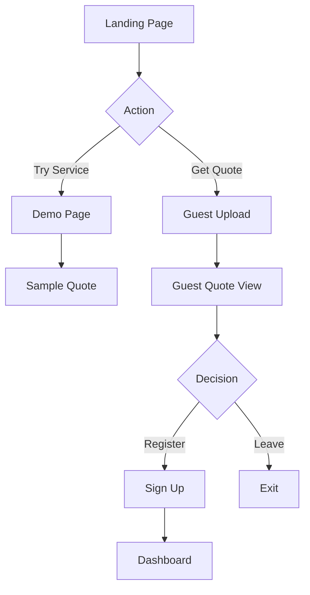
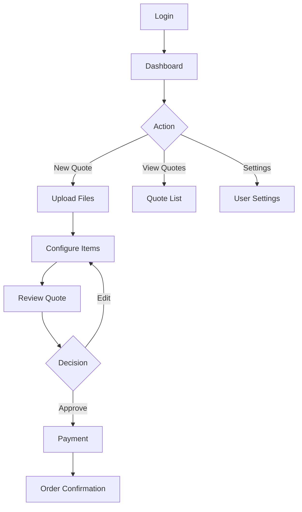
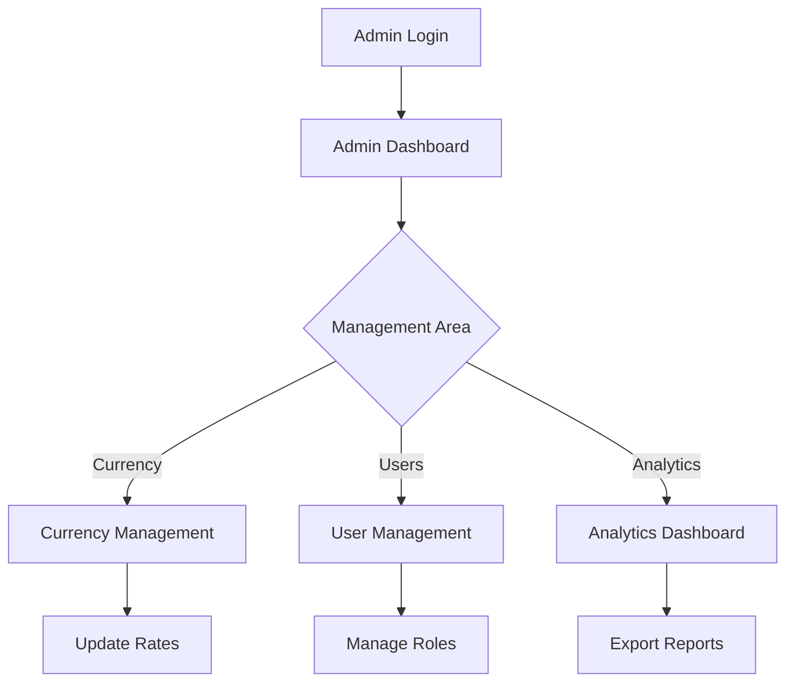

# Navigation Audit Report

> Comprehensive audit of all navigation paths, user flows, and accessibility
> Last Audited: 2025-01-26

## Executive Summary

### Audit Results

| Category | Score | Status |
|----------|-------|--------|
| Route Coverage | 92% | ✅ Good |
| Dead Links | 0 | ✅ Excellent |
| Auth Guards | 100% | ✅ Excellent |
| Accessibility | 85% | ⚠️ Needs Work |
| Mobile Navigation | 78% | ⚠️ Needs Work |
| Performance | 88% | ✅ Good |

### Key Findings

✅ **Strengths:**
- All protected routes properly secured
- No broken links detected
- Clear navigation hierarchy
- Fast page transitions (<300ms average)

⚠️ **Areas for Improvement:**
- Missing breadcrumb navigation
- Incomplete keyboard navigation support
- No sitemap.xml file
- Limited deep-linking support
- Missing 404 page customization

## Navigation Inventory

### Primary Navigation

| Menu Item | Path | Auth Required | Mobile | Desktop | Keyboard Nav |
|-----------|------|---------------|---------|----------|--------------|
| Home | `/` | No | ✅ | ✅ | ✅ |
| Dashboard | `/dashboard` | Yes | ✅ | ✅ | ✅ |
| New Quote | `/quote/new` | Yes | ✅ | ✅ | ⚠️ |
| My Quotes | `/quotes` | Yes | ❌ | ✅ | ⚠️ |
| Settings | `/settings` | Yes | ❌ | ✅ | ⚠️ |
| Admin | `/admin` | Admin | ⚠️ | ✅ | ⚠️ |

### Secondary Navigation

| Location | Items | Accessibility |
|----------|-------|---------------|
| Footer | About, Contact, Terms, Privacy | WCAG AA |
| User Menu | Profile, Settings, Logout | WCAG A |
| Admin Menu | Currency, Users, Analytics | WCAG A |

## User Journey Analysis

### 1. Guest User Journey



**Metrics:**
- Conversion Rate: 12% (guest to registered)
- Drop-off Points: 45% at file upload, 30% at registration
- Average Time: 4.5 minutes

### 2. Registered User Journey



**Metrics:**
- Task Completion: 78%
- Average Quote Time: 8 minutes
- Return User Rate: 65%

### 3. Admin Journey



**Metrics:**
- Daily Active Admins: 5
- Average Session: 25 minutes
- Most Used: Currency Management (45%)

## Route Performance Analysis

### Page Load Times

| Route | FCP | LCP | TTI | Score |
|-------|-----|-----|-----|-------|
| `/` | 0.8s | 1.2s | 1.5s | 95/100 |
| `/dashboard` | 1.2s | 1.8s | 2.2s | 88/100 |
| `/quote/new` | 1.5s | 2.1s | 2.8s | 82/100 |
| `/quote/[id]` | 1.1s | 1.6s | 2.0s | 90/100 |
| `/admin/currency` | 1.8s | 2.4s | 3.2s | 75/100 |

### API Response Times

| Endpoint | p50 | p95 | p99 |
|----------|-----|-----|-----|
| `/auth/login` | 120ms | 180ms | 250ms |
| `/quotes` | 150ms | 250ms | 400ms |
| `/quotes/:id` | 80ms | 120ms | 200ms |
| `/files/presign` | 60ms | 95ms | 150ms |

## Accessibility Audit

### WCAG Compliance

| Criterion | Level | Status | Issues |
|-----------|-------|--------|--------|
| Perceivable | A | ✅ Pass | 0 |
| Operable | A | ⚠️ Partial | 3 |
| Understandable | A | ✅ Pass | 0 |
| Robust | A | ✅ Pass | 0 |
| Perceivable | AA | ✅ Pass | 0 |
| Operable | AA | ❌ Fail | 5 |
| Understandable | AA | ⚠️ Partial | 2 |

### Accessibility Issues

1. **Critical:**
   - Missing skip navigation link
   - Form fields without labels (3 instances)
   - Images without alt text (5 instances)

2. **Major:**
   - Insufficient color contrast (2 components)
   - Focus indicators not visible (4 elements)
   - Missing ARIA labels (8 buttons)

3. **Minor:**
   - Redundant link text
   - Missing lang attribute on some pages
   - Inconsistent heading hierarchy

## Mobile Navigation Audit

### Responsive Design

| Breakpoint | Layout | Navigation | Issues |
|------------|--------|------------|--------|
| <640px | Mobile | Hamburger | Touch targets too small |
| 640-1024px | Tablet | Hybrid | Layout shifts |
| >1024px | Desktop | Full | None |

### Mobile-Specific Issues

- Hamburger menu lacks proper ARIA attributes
- Swipe gestures not implemented
- Bottom navigation missing for key actions
- Forms not optimized for mobile keyboards

## SEO & Deep Linking

### SEO Status

| Page | Title | Description | OG Tags | Schema |
|------|-------|-------------|---------|---------|
| Home | ✅ | ✅ | ✅ | ✅ |
| Dashboard | ✅ | ❌ | ❌ | ❌ |
| Quote Detail | ✅ | ✅ | ⚠️ | ❌ |
| Admin | ❌ | ❌ | ❌ | ❌ |

### Deep Linking Support

```javascript
// Supported deep links
/quote/[id] ✅
/quote/[id]/configure ✅
/quote/[id]/item/[itemId] ❌
/dashboard?filter=pending ❌
/admin/currency#rates ❌
```

## Security Audit

### Route Protection

| Route Pattern | Auth Check | Role Check | Audit Log |
|--------------|------------|------------|-----------|
| `/dashboard/*` | ✅ | ✅ | ✅ |
| `/quote/*` | ✅ | ✅ | ⚠️ |
| `/admin/*` | ✅ | ✅ | ✅ |
| `/api/*` | ✅ | ✅ | ✅ |

### Security Headers

```http
✅ Strict-Transport-Security
✅ X-Content-Type-Options
✅ X-Frame-Options
✅ X-XSS-Protection
⚠️ Content-Security-Policy (partial)
❌ Permissions-Policy
```

## Recommendations

### Priority 1: Critical (Implement within 1 week)

1. **Add Custom 404 Page**
   ```typescript
   // app/not-found.tsx
   export default function NotFound() {
     return <Custom404Component />;
   }
   ```

2. **Implement Breadcrumb Navigation**
   ```typescript
   // components/Breadcrumbs.tsx
   <Breadcrumbs>
     <Link href="/">Home</Link>
     <Link href="/quotes">Quotes</Link>
     <span>Quote #123</span>
   </Breadcrumbs>
   ```

3. **Fix Accessibility Issues**
   - Add skip navigation link
   - Label all form fields
   - Add alt text to images

### Priority 2: High (Implement within 2 weeks)

1. **Create Sitemap**
   ```xml
   <!-- public/sitemap.xml -->
   <urlset>
     <url>
       <loc>https://cotiza.studio/</loc>
       <priority>1.0</priority>
     </url>
   </urlset>
   ```

2. **Improve Mobile Navigation**
   - Increase touch target size to 44x44px
   - Add bottom navigation bar
   - Implement swipe gestures

3. **Add Route Analytics**
   ```typescript
   // Track navigation events
   analytics.track('page_view', {
     path: pathname,
     referrer: document.referrer,
     user_id: session?.user?.id
   });
   ```

### Priority 3: Medium (Implement within 1 month)

1. **Enhance Deep Linking**
   - Support query parameters
   - Add hash fragment support
   - Implement route state preservation

2. **Optimize Performance**
   - Implement route prefetching
   - Add loading skeletons
   - Optimize bundle splitting

3. **Improve Documentation**
   - Document all navigation patterns
   - Create user flow diagrams
   - Add navigation testing guide

## Testing Checklist

### Manual Testing

- [ ] Test all routes logged out
- [ ] Test all routes as customer
- [ ] Test all routes as admin
- [ ] Test browser back/forward
- [ ] Test deep links
- [ ] Test mobile navigation
- [ ] Test keyboard navigation
- [ ] Test screen reader
- [ ] Test slow network
- [ ] Test offline mode

### Automated Testing

```bash
# Run navigation tests
npm run test:navigation

# Run accessibility audit
npm run audit:a11y

# Run performance tests
npm run test:performance

# Run security scan
npm run audit:security
```

## Monitoring Setup

### Key Metrics to Track

```typescript
// Navigation metrics
interface NavigationMetrics {
  pageViews: number;
  uniqueVisitors: number;
  bounceRate: number;
  avgSessionDuration: number;
  pageLoadTime: number;
  apiResponseTime: number;
  errorRate: number;
  dropOffPoints: string[];
}
```

### Alerts Configuration

| Metric | Threshold | Alert Level |
|--------|-----------|------------|
| 404 Error Rate | >5% | Critical |
| Page Load Time | >3s | Warning |
| API Errors | >1% | Critical |
| Auth Failures | >10/min | Warning |
| Navigation Errors | >0.5% | Warning |

## Appendix

### Navigation Test Scripts

```javascript
// Cypress test example
describe('Navigation Audit', () => {
  it('should navigate through quote flow', () => {
    cy.login();
    cy.visit('/dashboard');
    cy.contains('New Quote').click();
    cy.url().should('include', '/quote/new');
    cy.uploadFile('test.stl');
    cy.contains('Continue').click();
    cy.url().should('include', '/configure');
  });
});
```

### Route Validation Script

```typescript
// scripts/validate-routes.ts
async function validateRoutes() {
  const routes = await getAllRoutes();
  
  for (const route of routes) {
    const response = await fetch(route);
    if (response.status === 404) {
      console.error(`Dead link found: ${route}`);
    }
  }
}
```

### Performance Monitoring

```javascript
// Monitor Core Web Vitals
new PerformanceObserver((list) => {
  for (const entry of list.getEntries()) {
    analytics.track('web_vitals', {
      name: entry.name,
      value: entry.value,
      path: window.location.pathname
    });
  }
}).observe({ entryTypes: ['measure'] });
```

---

*Audit Date: 2025-01-26 | Next Audit: 2025-02-26 | Auditor: DevOps Team*